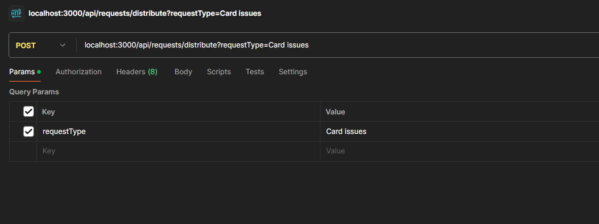
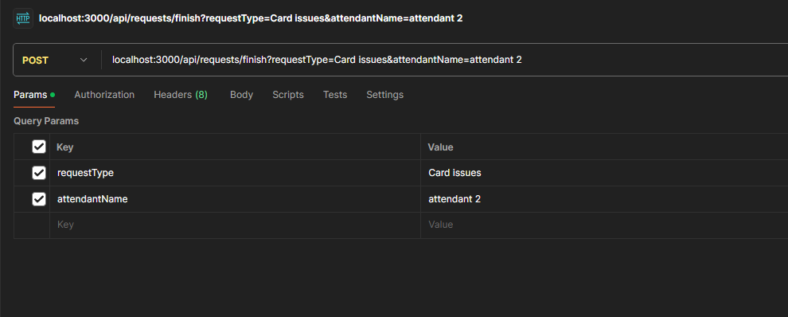

# Invext

REST API developed to complete the technical test for Ubots.

## 🚀 Getting Started

These instructions will allow you to run the project without difficulties.

### 📋 Prerequisites

Java 22. You can download it from this [link](https://www.oracle.com/java/technologies/javase/jdk22-archive-downloads.html).

IntelliJ IDEA. You can download it from this [link](https://www.jetbrains.com/pt-br/idea/)

🔧 Installation

After cloning the project locally, you need to run the Maven install through IntelliJ or using the command:

```
  - install -f pom.xml
```
### 🏗️ Build

Once the Maven install is complete, the project is ready to be executed. Use Shift + F10 on the class [InvextApplication.java](src/main/java/com/ubots/invext/InvextApplication.java).

### ⚙️ Consuming the REST API

The project has two endpoints:

```shell
  # Distribute request
  
  - POST: localhost:3000/api/requests/distribute
    - Request Param: requestType
        - Expected values: Card Issues, Loan Application, and Other Issues
  
  # Finish request
  
  - POST: localhost:3000/api/requests/finish
    - Request Param: requestType
        - Expected values: Card Issues, Loan Application, and Other Issues
    
    - Request Param: attendantName    
        - Expected values:
          - Attendant 1 or Attendant 2 for requestType Card Issues
          - Attendant 3 or Attendant 4 for requestType Loan Application
          - Attendant 5 or Attendant 6 for requestType Other Issues
        
```

Examples:

- POST: localhost:3000/api/requests/distribute




- POST: localhost:3000/api/requests/finish



## 🛠️ Built With

Tools used:

* [Intellij](https://www.jetbrains.com/pt-br/idea/) - Source code editor

## 🖇️ Collaborating

* **Wellyson Marques** - *Backend* - [Dev](https://github.com/WellysonM)
